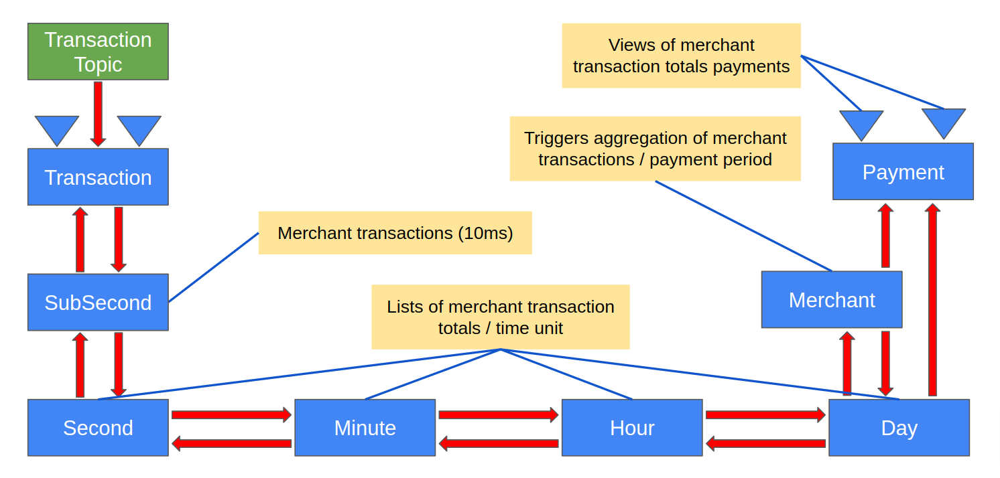

# Merchant Payment Transaction Aggregator Java Demo

This project is a demo of a merchant payment transaction aggregator. The processing flow is transactions consumed from a topic then aggregated into periodic merchant payments. Each transaction includes merchant information that routes aggregated transaction amounts to specific merchant payments. Merchants define the frequency and times of their payment schedule.

Transactions initially flow into a transaction entity, and transaction-created events flow into a series of time-based aggregation entities. These time-based aggregation entities form a tree from sub-second leaves to second branches through more time-based branches down to merchant payment trunks. A reduction of payment data occurs as payment amounts flow from the sub-second leaves down to the trunk.

The time-based aggregation entities perform two tasks. The first task is called activation, and the second task is called aggregation.

Activation starts when a sub-second entity first receives a transaction. Each sub-second entity represents a specific 10ms period in time. For example, when a transaction arrives as 2022-03-23T15:20:56.674546967Z, the below table shows times from epoch sub-second to epoch day.

| Timestamp  | 2022-03-23T15:20:56.674546967Z |
| :--------- | -----------------------------: |
| Epoch unit |                     Epoch time |
| ms         |              1,648,048,856,674 |
| sub-second |                164,804,885,667 |
| second     |                  1,648,048,856 |
| minute     |                     27,467,480 |
| hour       |                        457,791 |
| day        |                         19,074 |

Once an epoch sub-second instance is activated, no other activation events are needed as more transactions arrive within that same sub-second.

As each sub-second entity is activated, it emits an activation event consumed by its associated second entity, which triggers activation of the second entity. No other second activations occur as more sub-seconds within the exact second are activated, and activations propagate up the time tree until they reach a merchant entity.

Each time-based entity keeps a list of its currently active sub-time entities. For example, a given day entity knows which hours are active, an hour knows which minutes are active, minutes know which seconds are active, and seconds know which sub-seconds are active. Sub-second entities maintain a list of transactions, and these transactions also indicate if they are ready to be aggregated or previously aggregated.

When a merchant entity receives a day-activated event, it emits an aggregation requested event. This aggregation requested event triggers the active day entity to forward the request to its active hours—then hours to minutes, minutes to seconds, and seconds to sub-seconds. Aggregation requests flow up the tree in a highly concurrent wave that flows from the trunk out of each of the currently active sub-second leaves.

Each active sub-second entity receives an aggregation request. This request triggers an operation that sums up the ready-to-be aggregated transactions. Aggregated transactions are flagged as aggregated by setting a payment Id field. After an aggregation is completed, the entity emits an event with a reduced transaction amount. Second entities receive these sub-second reduced events, and when all of the active sub-seconds have sent their results, the second entity sums those amounts. It emits an event that contains the transaction amount total.

The aggregation process goes down the tree through sub-seconds, seconds, minutes, hours, days, and up to the current merchant payment entity. The payment entity accumulates the incremental amounts on each aggregation cycle until it is requested to produce a payment.


| 
|:--:
| Figure 1 - Merchant Payment Transactions Aggregator Design

The above design shows multiple service component entities that interact with each other via asynchronous event flows. The boxes represent entities encapsulating service APIs, processing logic, and emitting state change events. A more generic event flow diagram shown below (Figure 2) depicts a micro stream. Micro streams are these event-driven flows where services interact via asynchronous event streams. The arrows in these micro stream diagrams represent the events emitted by upstream services flowing to downstream services. Note that micro stream flows are often bidirectional. With Bidirectional flows, service A emits events consumed by service B, and service B emits events consumed by service A.

| 
|:--:
| Figure 2 - Micro Stream Event Flows

The following diagram (Figure 3) shows more of the implementation details of micro streams. Each service entity includes a defined API and specific event types. Entities receive requests as commands via the API. Commands are requests to perform entity state-changing actions, such as a command to add an item to a shopping cart, and events represent specific entity state changes. So, commands are requests to perform actions while events are historical facts about things that have happened in the past.

Each arrow represents an event store or event journal, and these event stores are also event/message delivery topics. Arrowheads represent actions that consume incoming events and then transform them into commands forwarded to downstream entities.

The triangles in the diagram represent queryable views. Views also consume entity events transforming them into view data.

| 
|:--:
| Figure 3 - Micro Stream Overview

---

## The following sections were generated when this project was created

See [Development Tools/Maven archetype](https://developer.lightbend.com/docs/akka-serverless/java/developer-tools#_maven_archetype)

## Designing

While designing your service it is useful to read [designing services](https://developer.lightbend.com/docs/akka-serverless/services/development-process.html)

## Developing

This project has a bare-bones skeleton service ready to go, but in order to adapt and
extend it it may be useful to read up on [developing services](https://developer.lightbend.com/docs/akka-serverless/developing/index.html)
and in particular the [Java section](https://developer.lightbend.com/docs/akka-serverless/java-services/index.html)

## Building

You can use Maven to build your project, which will also take care of
generating code based on the `.proto` definitions:

```shell
mvn compile
```

## Running Locally

In order to run your application locally, you must run the Akka Serverless proxy. The included `docker-compose` file contains the configuration required to run the proxy for a locally running application.
It also contains the configuration to start a local Google Pub/Sub emulator that the Akka Serverless proxy will connect to.
To start the proxy, run the following command from this directory:

```shell
docker-compose up
```

To start the application locally, the `exec-maven-plugin` is used. Use the following command:

```shell
mvn compile exec:exec
```

With both the proxy and your application running, any defined endpoints should be available at `http://localhost:9000`. In addition to the defined gRPC interface, each method has a corresponding HTTP endpoint. Unless configured otherwise (see [Transcoding HTTP](https://developer.lightbend.com/docs/akka-serverless/java/proto.html#_transcoding_http)), this endpoint accepts POST requests at the path `/[package].[entity name]/[method]`. For example, using `curl`:

```shell
> curl -XPOST -H "Content-Type: application/json" localhost:9000/io.example.CounterService/GetCurrentCounter -d '{"counterId": "foo"}'
The command handler for `GetCurrentCounter` is not implemented, yet
```

For example, using [`grpcurl`](https://github.com/fullstorydev/grpcurl):

```shell
> grpcurl -plaintext -d '{"counterId": "foo"}' localhost:9000 io.example.CounterService/GetCurrentCounter 
ERROR:
  Code: Unknown
  Message: The command handler for `GetCurrentCounter` is not implemented, yet
```

> Note: The failure is to be expected if you have not yet provided an implementation of `GetCurrentCounter` in
> your entity.

## Deploying

To deploy your service, install the `akkasls` CLI as documented in
[Setting up a local development environment](https://developer.lightbend.com/docs/akka-serverless/setting-up/)
and configure a Docker Registry to upload your docker image to.

You will need to update the `dockerImage` property in the `pom.xml` and refer to
[Configuring registries](https://developer.lightbend.com/docs/akka-serverless/projects/container-registries.html)
for more information on how to make your docker image available to Akka Serverless.

Finally, you can use the [Akka Serverless Console](https://console.akkaserverless.com)
to create a project and then deploy your service into the project either by using `mvn deploy` which
will also conveniently package and publish your docker image prior to deployment, or by first packaging and
publishing the docker image through `mvn clean package docker:push -DskipTests` and then deploying the image
through the `akkasls` CLI or via the web interface.
